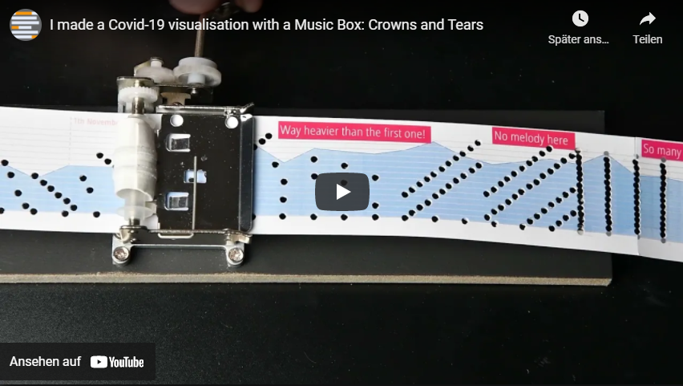
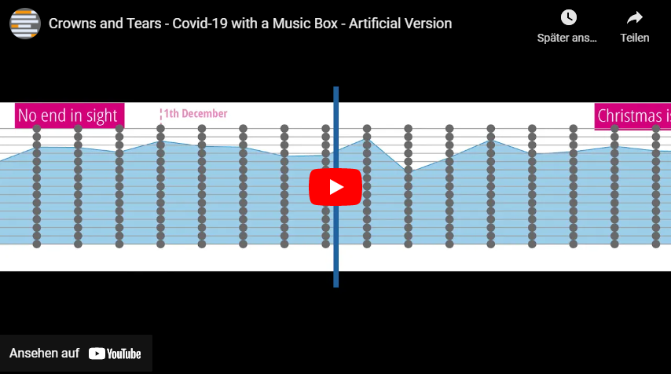

# Crowns and Tears - Covid-19 visualisation using a music box, punch cards and too much of spare time...
How are you? Hope you are doing well! Here you find everything I used to make a Covid-19 visualisation from my home country using a music box and punch cards. Feel free to contact me!  
Stay healthy!  
Simon  
[journalist.ch](https://www.journalist.sh)
## Crowns and Tears - How it sounds

## Crowns and Tears - What it should have sounded like

## Here you will find:
* [The Sheet of Music](sheet/crowns_and_tears.pdf)
* [A sound file (mp3)](sheet/crowns_and_tears.mp3)
* [The punch card](sheet/crowns_and_tears_stripes.pdf)
* [The Source Code](python/create%20stripes.ipynb)
* And other stuff like the inDesign version, a musicxml-export, etc. 

## Is is a data viz? Is it a data representation?
Good question. Maybe both? In the background you see the death rate per day as a curve chart with annotations. The music follows the data but does not represent it number by number. Here some background information how I made it:  
My first approach was: Let's give each note a number of death. Ofter composing couple bars I had to acknowledge: That's not how music works. Intensity and emotion in music is not about stacking more notes together. Sometimes nothing can hit you more than a quarter break. Dissonancec, tempo, chords, dynamics - so many things bring music to live. So I changed my approach and tried to write a corresponding soundtrack to the data. On the right side of my screen I had the data, day by day. Ond the left the music notation software. I went through every day in the data and looked for the corresponding sound, that respresents the data and still follows the rules of music.

## How it works
I used [Muse Score](https://musescore.org/de) to compose the song. The python script does this:
* Imports the sheets of music (it has to be saved as an uncompressed musicxml)
* Converts it to an array where the lowest note (C) = 0. Each Array item represents a bar.
* The array is now transformed into punch cards and saved as a SVG graphic.
* The script now creates a PDF to print. I did not used this, I opend the svg in inDesign and added text.

## What you should consider
* I used this music box from [Banggood](https://www.banggood.com/DIY-Hand-Cranked-Music-Box-15-Tone-Wooden-Box-With-Hole-Puncher-And-Paper-Tapes-Birthday-Gift-Present-p-1040359.html).
* I wrote it in C-Mayor (A-Minor) but the music box is actually in A flat major (or something like that).
* If you like to play the same note twice, you need to leave some space between (at least a quarter, like the «days» in the video above). Otherwise the music box is not able to play it.
* I printed it on 160g paper and sticked it to another 80g paper.
* Ask your doctor if you get a typewriter's cramp from stamping out the cards...

## Behind the Scenes
* The Swiss radio RTS presented Crowns and Tears where I gave some insights. [You will find it here (french).](https://www.rts.ch/play/radio/vertigo/audio/vivre-en-musique-lemotion-du-nombre-de-morts-du-covid-en-suisse?id=12049399)
* AFP and La Presse did [write about it too.](https://www.lapresse.ca/actualites/insolite/2021-03-31/suisse/une-boite-a-musique-pour-raconter-l-epidemie-de-covid-19.php)